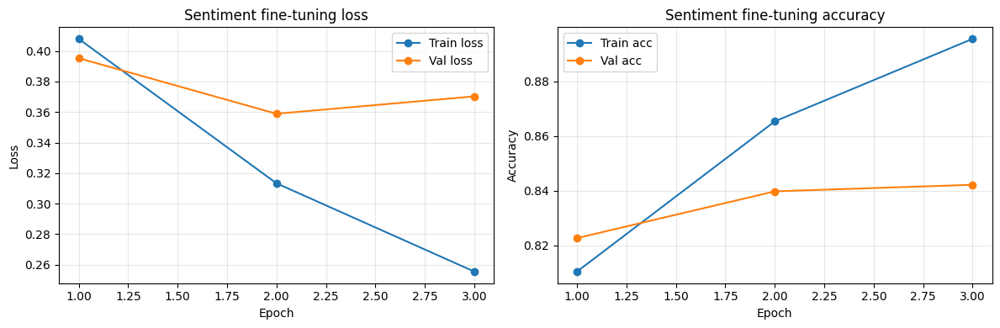

# mini GPT 구현 과제 보고서

## 0. 반·팀원

| 항목 | 내용 |
| --- | --- |
| 반 | AI 2반 |
| 팀명 | 1팀 |
| 팀원 | 이진혁, 이윤지, 이해건, 송영진 |

---

## 1. 구현 현황

| 단계 | 구현 내용 | 구현 파일 | 담당자 |
| --- | --- | --- | --- |
| 1 | UTF-8 byte-level BPE tokenizer 구현, 특수 토큰/byte 토큰 초기화, merge 학습, save/load, encode/decode | `src/bpe.py` | 이진혁, 이윤지, 이해건, 송영진 |
| 2 | 다음 토큰 예측용 GPTDataset, create_dataloader, token/position embedding 구현 | `src/dataset.py`, `src/embeddings.py` | 이진혁, 이윤지, 이해건, 송영진 |
| 3 | MultiHeadAttention, scaled dot-product attention, causal mask 구현 | `src/attention.py` | 이진혁, 이윤지, 이해건, 송영진 |
| 4 | LayerNorm, GELU, FeedForward, TransformerBlock, GPTModel, generate_text_simple 구현 | `src/model.py` | 이진혁, 이윤지, 이해건, 송영진 |
| 5 | loss 계산, checkpoint save/load, top-k/temperature generate, train_model, learning rate warmup 구현 | `src/train.py` | 이진혁, 이윤지, 이해건, 송영진 |
| 6 | NSMC 감성 분류 Dataset, GPT backbone 기반 classifier, train/evaluate loop 구현 | `src/finetune.py` | 이진혁, 이윤지, 이해건, 송영진 |

---

## 2. 테스트 통과 현황

| 실행 명령 | 결과 | 비고 |
| --- | --- | --- |
| `pytest tests/test_bpe.py -v` | 통과 | BPE 학습, 저장/로드, encode/decode 확인 |
| `pytest tests/test_dataset.py -v` | 통과 | Dataset 길이, input/target shift, embedding shape 확인 |
| `pytest tests/test_attention.py -v` | 통과 | attention output shape, causal mask, attention weight 확인 |
| `pytest tests/test_model.py -v` | 통과 | GPT 구성 요소, forward logits/loss, generation 확인 |
| `pytest tests/test_train.py -v` | 통과 | loss, checkpoint, generate, plot, lr warmup 확인 |
| `pytest tests/test_finetune.py -v` | 통과 | 감성 데이터 생성, classifier, train/eval 확인 |
| `pytest tests/ -v` | 통과 | 전체 단위 테스트 통과 |

현재 필수 구현 테스트 기준으로 실패한 테스트는 없습니다.

| 실패한 테스트 | 에러 요약 | 해결 시도 |
| --- | --- | --- |
| 없음 | 없음 | 없음 |

---

## 3. 데이터

| 항목 | 내용 |
| --- | --- |
| 원본 데이터 | NSMC |
| 원본 경로 | `data/ratings_train.txt`, `data/ratings_test.txt` |
| 사전 학습 데이터 | `data/nsmc_lm_train.txt`, `data/nsmc_lm_val.txt` |
| 미세 조정 데이터 | `data/nsmc_sentiment_train.jsonl`, `data/nsmc_sentiment_val.jsonl`, `data/nsmc_sentiment_test.jsonl` |
| 전처리 방식 | 빈 리뷰 제거, 연속 공백 정리, train/validation 분리, 감성 분류용 JSONL 변환 |
| 사용한 데이터 크기 | 사전 학습: train `1_500_000` chars / val `100_000` chars, 미세 조정: train `80_000`개 / val `10_000`개 / test `10_000`개 제한 |

---

## 4. BPE

| 항목 | 내용 |
| --- | --- |
| 구현 파일 | `src/bpe.py` |
| BPE 방식 | UTF-8 byte-level BPE |
| 특수 토큰 ID | `<pad>=0`, `<unk>=1`, `<bos>=2`, `<eos>=3` |
| byte token ID 범위 | 4~259 |
| vocab_size | 3000 |
| 학습 corpus 크기 | tokenizer 파일이 없으면 전체 `corpus`로 학습, 사전 학습 입력은 `corpus[:1_500_000]` 사용 |
| 어휘 학습 시간 | 별도 기록 없음 |
| vocabulary 저장 경로 | `data/bpe_tokenizer_vocab3000.json` |
| 인코딩/디코딩 복원 예시 | `decode(encode("이 영화는 정말 좋았다! English 123", add_bos_eos=True))`가 특수 토큰을 제외한 원문으로 복원됨 |

---

## 5. 모델 구조

| 항목 | 내용 |
| --- | --- |
| 구현 파일 | `src/model.py` |
| 전체 구조 | InputEmbedding -> N x TransformerBlock -> LayerNorm -> LM head |
| vocab_size | 3000 |
| context_length | 64 |
| emb_dim | 256 |
| n_heads | 8 |
| n_layers | 4 |
| drop_rate | 0.0 |
| qkv_bias | False |
| 총 파라미터 수 | 4,708,864개. 계산식: token embedding `3000*256` + position embedding `64*256` + block 4개 `4*788,992` + final LayerNorm `2*256` + LM head `256*3000` |

---

## 6. 사전 학습

### 6.1 하이퍼파라미터

| 구분 | 항목 | 값 |
| --- | --- | --- |
| 모델 | vocab_size | 3000 |
| 모델 | context_length | 64 |
| 모델 | emb_dim | 256 |
| 모델 | n_heads | 8 |
| 모델 | n_layers | 4 |
| 학습 | batch_size | CUDA 16, CPU 4 |
| 학습 | num_epochs | 8 |
| 학습 | eval_freq, eval_iter | `eval_freq=max(1, len(train_loader)//2)`, `eval_iter=min(20, len(val_loader))` |
| 최적화 | lr, weight_decay | AdamW, lr `2e-3`, weight_decay `0.1`, warmup_steps `100` |

### 6.2 결과

| 항목 | 내용 |
| --- | --- |
| train loss | 최적 조합 8 epoch 기준 final train loss `4.988`, 20 epoch 기준 final train loss `4.846` |
| validation loss | 최적 조합 8 epoch 기준 final val loss `5.132`, 20 epoch 기준 final val loss `5.071` |
| 손실 그래프 | `assemble1(에포크8).png`, `assemble(epoch20).png` |
| 생성 샘플 | 시작 문맥 `"이 영화는"`, `max_new_tokens=80`, `temperature=0.8`, `top_k=40`으로 epoch마다 확인 |
| checkpoint 경로 | `train_model`은 `checkpoint_epoch_<epoch>.pt` 저장을 지원하지만, 현재 노트북 호출은 `ckpt_freq=None`으로 자동 저장 비활성화 |

---

## 7. 미세 조정

| 항목 | 내용 |
| --- | --- |
| 구현 파일 | `src/finetune.py` |
| 과제 | NSMC 리뷰 긍정/부정 분류 |
| 데이터 포맷 | JSONL, `text`, `label` |
| 데이터 크기 | train `80_000`개, val `10_000`개, test `10_000`개 |
| max_length | `AUTO_MAX_LENGTH=True`, 최종 cap `64` |
| batch_size | CUDA 16, CPU 4 |
| num_epochs | 3 |
| 최종 설정 | `FREEZE_BACKBONE=False`, `FINETUNE_LR=3e-4` |
| backbone learning rate | `3e-4` |
| classifier learning rate | `3e-4` |
| validation loss / accuracy | val loss `0.370`, val acc `0.842` |
| test loss / accuracy | test loss `0.371`, test acc `0.844` |
| 오류 예시 | 오분류 분석은 별도 수집 전. 짧은 반어/비꼼 리뷰, 긍·부정 단어가 함께 등장하는 리뷰, 문맥이 긴 리뷰를 우선 확인 예정 |

---

## 8. 실험 환경

| 항목 | 내용 |
| --- | --- |
| Python | Python 3.11 기준 |
| PyTorch | `requirements.txt` 기준 PyTorch `>=2.0.0`, 실험 그래프 기록 기준 PyTorch `2.12.0` |
| 실행 환경 | Colab GPU 및 로컬 노트북 실행 환경 |
| GPU/CPU 정보 | 그래프 기록 기준 device `mps`, 노트북은 CUDA 사용 가능 시 GPU 아니면 CPU/MPS 사용 |
| 총 학습 소요 시간 | 별도 기록 없음 |

---

## 9. 고찰
- [LLM 실험실 ] https://sisupage.notion.site/3747564c170b80c38844e5868de89308?v=3747564c170b80a1ad92000cb856096e&source=copy_link

### GPT 모델 성능 개선 요약

우리 팀은 GPT 성능 개선을 모델 크기만 키우는 방식으로 접근하지 않았다. 먼저 loss가 잘 내려가지 않는 현상을 관찰하고, 그 원인을 tokenizer 난도, learning rate, context length, model capacity, regularization, 문장 경계 정보로 나누어 가설을 세웠다. 이후 한 번에 하나의 변수를 바꾸며 train loss, validation loss, train-val gap, 생성 샘플을 비교했다.

### 가설 -> 결론 루프

| 단계 | 가설 | 결론 |
| --- | --- | --- |
| 초기 baseline | `vocab_size=10000`은 작은 GPT와 NSMC corpus에 비해 너무 커서 token 예측이 어렵다. | 2M train chars, 2000 steps에서도 val loss가 `8.116` 수준에 머물러 tokenizer 난도 축소가 필요했다. |
| vocab size 축소 | vocab을 `3000`으로 줄이면 token sparsity가 줄고 학습이 쉬워진다. | vocab 3000 실험군에서 loss가 5점대까지 내려가 이후 실험의 기준 tokenizer가 됐다. |
| learning rate sweep | learning rate가 너무 낮거나 높으면 수렴이 나빠진다. | `lr=0.002`에서 final val loss `5.249`로 가장 안정적인 결과를 얻었다. |
| context length 비교 | context를 길게 하면 더 많은 문맥을 보고 예측할 수 있다. | context 128은 update step 수가 줄어 val loss `5.875`로 나빴고, 최종적으로 `context_length=16`을 절충값으로 선택했다. |
| model capacity 확장 | `emb=128`, `layers=2`는 표현력이 부족하다. | `emb=256`, `heads=8`, `layers=4`에서 val loss `5.370`으로 개선되어 capacity 부족 가설이 지지됐다. |
| dropout / weight decay 조정 | capacity 증가 후 regularization을 조정하면 validation loss가 낮아질 수 있다. | 현재 조건에서는 dropout이 학습을 방해했고, `drop_rate=0.0`, `weight_decay=0.1`이 더 나았다. |
| BOS/EOS 경계 token | 리뷰 사이 경계를 `<bos>`, `<eos>`로 알려주면 next-token target이 쉬워진다. | 실제 run에서 final validation loss가 `4.745`까지 내려가 가장 큰 후반부 개선이 됐다. |

### PRE-TRAINING 대표 그래프

### context_length 최적이 16이지만 64를 선택한 이유

실험상 pretraining loss만 보면 `context_length=16`이 가장 효율적이었다. 하지만 최종 설정에서는 이후 sentiment fine-tuning까지 고려해 `context_length=64`를 사용했다.

| 구분 | `context_length=16` | `context_length=64` |
| --- | --- | --- |
| Pretraining 관점 | 짧은 문맥만으로도 다음 token 패턴을 학습할 수 있어 효율적이다. | 더 긴 문맥을 보지만 step 수와 학습 비용이 늘어 pretraining loss만 보면 불리할 수 있다. |
| Fine-tuning 관점 | 리뷰 예제가 잘려 입력과 label의 관계를 충분히 보기 어렵다. | 더 긴 리뷰를 보존해 감성 분류에서 입력과 출력의 관계를 더 안정적으로 학습할 수 있다. |
| 최종 판단 | 사전 학습 loss 최소화에는 유리하다. | downstream task까지 고려한 절충값으로 최종 선택했다. |

### sentiment fine-tuning 가설 -> 결론 루프

사전 학습 loss가 낮아져도 감성 분류 성능이 자동으로 좋아지는 것은 아니기 때문에, backbone을 얼마나 학습시킬지와 learning rate를 따로 비교했다.

| 단계 | 가설 | 실험 설정 | 결과 | 결론 |
| --- | --- | --- | --- | --- |
| 데이터 확대 | fine-tuning 데이터가 많을수록 validation/test accuracy가 안정될 것이다. | train `80_000`, val/test `10_000` 기준으로 비교 | 기존 소규모 설정보다 평가가 안정적이었다. | 이후 실험의 공통 데이터 조건으로 사용 |
| freeze backbone | pretraining된 GPT를 고정하고 classifier만 학습해도 충분할 수 있다. | `lr=5e-5`, epoch 3, `FREEZE_BACKBONE=True` | val acc `0.643`, test acc `0.641` | classifier만으로는 성능이 부족해 backbone도 학습 필요 |
| backbone fine-tuning | GPT backbone까지 함께 조정하면 감성 분류 성능이 올라갈 것이다. | `lr=5e-5`, epoch 3, `FREEZE_BACKBONE=False` | val acc `0.836`, test acc `0.836` | backbone fine-tuning 효과가 큼 |
| learning rate 조정 | 너무 낮은 lr보다 조금 큰 lr이 task 적응을 빠르게 만들 수 있다. | `lr=3e-4`, epoch 3, `FREEZE_BACKBONE=False` | val acc `0.842`, test acc `0.844` | 최종 fine-tuning 설정으로 채택 |

| 최종 fine-tuning 설정 | 값 |
| --- | --- |
| train / val / test examples | `80_000` / `10_000` / `10_000` |
| max_length | `64` |
| freeze_backbone | `False` |
| learning_rate | `3e-4` |
| validation | loss `0.370`, acc `0.842` |
| test | loss `0.371`, acc `0.844` |

### FINE - TUNING 대표 그래프

### 최종 해석

- 한국어 byte-level BPE는 글자 단위가 아니라 UTF-8 byte 단위로 처리해야 decode 안정성을 유지할 수 있었다.
- 초기 loss 정체의 핵심 원인은 모델 구조 하나가 아니라 tokenizer 난도, learning rate, context length, capacity, regularization, 문장 경계 정보가 함께 얽힌 문제였다.
- 가장 큰 후반부 개선은 BOS/EOS 문장 경계 token이었다. 리뷰와 리뷰 사이의 불연속 전이를 모델이 억지로 학습하지 않아도 되면서 validation loss가 `4.745`까지 내려갔다.
- 다음 개선 후보는 warmup/cosine decay의 체계적 비교, BOS/EOS token cache key 분리, 생성 품질 정량 평가, checkpoint별 validation sample 분석이다.
